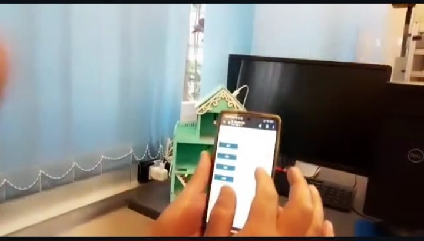

<h1 align="center">
  
</h1>

### Descrição:

- Este é um projeto de acionamento via um Web Server com NodeMCU utilizando HTML e CSS com protocolo HTTP.

<h1 align="left">
  
</h1>

### Clone o repositório:

- `$` git clone https://github.com/Planet-Makers-Original/Casinha-IoT.git

### Executar o código:

- Abra o progama na IDE do Arduíno, compile o programa e execute-o no NodeMCU.
- Abra o wifi do equipamento (celular, computador) e conect a rede com o nome: `Planet Makers` e senha: `17227285`.
- Abra o navegador e acesse o endereço `192.168.4.1`

### Licença:

Este programa é de domínio público e pode ser usado livremente.

Autor: `Alexande Yui`

Data: `16-01-2025`

### Contato:

- Você pode me contatar pelo e-mail [suporte@planetmakers.com.br](mailto:supote@planetmakers.com.br)
